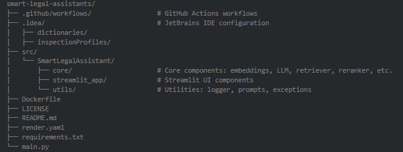

# Smart Legal Assistants using Retrieval Augmented Generation (RAG)
A scalable, beginner-friendly application for answering legal questions using a document knowledge base with Retrieval-Augmented Generation (RAG).

## What is RAG?
Retrieval-Augmented Generation (RAG) is an advanced technique in NLP that combines two key components:

**Retrieval**: Finds relevant content (e.g., from your uploaded documents).

**Generation**: Uses a language model (like GPT) to generate a contextual answer based on the retrieved content.

This ensures responses are:
- Grounded in facts
- Transparent with references
- Scalable to your custom knowledge base

## Project Purpose
To help legal teams or individuals query legal documents in natural language, getting accurate, reference-backed responses — with a user-friendly interface and easily configurable backend.

Even junior data scientists can run, extend, or deploy this project.

## Features
- **Document Retrieval**: Uses vector search (e.g., via Pinecone) to locate the most relevant documents.
- **Modular Pipeline**: Each stage (embedding, retrieval, generation) is customizable.
- **Customizable Prompts**: Easily change how the model responds using templates.
- **Query Enhancement**: Optional query expansion + reranking logic to improve relevance.
- **Streamlit UI**: Clean, interactive frontend for querying and feedback.
- **Deployment Ready**: Works with Docker or Render for one-click cloud hosting.

## Technologies Used
| **Tool** | **Purpose** |
|----------|-------------|
| **Python** | Main programming language |
| **Streamlit** | Web app interface |
| **Pinecone** | Vector database for semantic search |
| **TogetherAI** | Large language models for response generation |
| **Docker** | Containerization for consistent deployment |

## Code Structure



##  Quick Setup Guide

### Prerequisites
Make sure you have:
- Python ≥ 3.8
- pip (Python package manager)
- Git

### Step 1: Clone the Repository
```bash
git clone https://github.com/Mkayatw0/smart-legal-assistant.git
cd smart-legal-assistant
```

### Step 2: Create Virtual Environment
```bash
# Create virtual environment
python -m venv venv

# Activate (Mac/Linux)
source venv/bin/activate

# Activate (Windows Git Bash)
source venv/Scripts/activate
```

### Step 3: Install Dependencies
```bash
# Method 1: Using pyproject.toml (Recommended)
pip install -e .

# Method 2: If above fails, install manually
pip install --upgrade pip
pip install together pinecone-client python-dotenv streamlit sentence-transformers langchain
```

### Step 4: Get Your API Keys

#### Together.ai API Key
1. Go to https://api.together.xyz/
2. Sign up/login and get your API key

#### Pinecone Setup
1. Go to https://app.pinecone.io/
2. Sign up/login to your dashboard
3. **Find your environment**: Look at top-right corner (e.g., `us-east-1-aws`)
4. **Create an index**:
   - Click "Create Index"
   - Name: `legal-assistant-index`
   - Dimensions: `1536`
   - Metric: `cosine`
   - Pod type: `p1.x1` or `s1.x1`

### Step 5: Configure Environment Variables
Create a `.env` file in the project root:

```env
# Together AI (both keys needed - the app checks for both)
TOGETHER_API_KEY=your_together_api_key_here
TOGETHER_AI_API_KEY=your_together_api_key_here

# Pinecone Configuration
PINECONE_API_KEY=your_pinecone_api_key_here
PINECONE_ENVIRONMENT=us-east-1-aws
PINECONE_INDEX_NAME=legal-assistant-index
PINECONE_NAMESPACE=legal-docs
```

### Step 6: Test Your Setup
```bash
# Quick test to verify API keys are loaded
python -c "
from dotenv import load_dotenv
import os
load_dotenv()
print('TOGETHER_AI_API_KEY:', 'Found' if os.getenv('TOGETHER_AI_API_KEY') else 'Missing')
print('PINECONE_API_KEY:', 'Found' if os.getenv('PINECONE_API_KEY') else 'Missing')
"
```

### Step 7: Run the Application
```bash
streamlit run src/SmartLegalAssistant/streamlit_app/main.py
```

Visit http://localhost:8501 in your browser to use the app.

##  Common Issues & Solutions

### Issue 1: `ModuleNotFoundError: No module named 'together'`
**Solution**: Install missing packages
```bash
pip install together pinecone-client python-dotenv
```

### Issue 2: `No such file or directory: venv/bin/activate`
**Solution**: Create virtual environment first
```bash
python -m venv venv
source venv/bin/activate  # Mac/Linux
# OR
source venv/Scripts/activate  # Windows Git Bash
```

### Issue 3: `Please provide a Together AI API key`
**Solution**: Add both API key formats to `.env`
```env
TOGETHER_API_KEY=your_key_here
TOGETHER_AI_API_KEY=your_key_here
```

### Issue 4: `ValueError: invalid literal for int() with base 0: '$PORT'`
**Solution**: This is a config issue, run with explicit port
```bash
streamlit run src/SmartLegalAssistant/streamlit_app/main.py --server.port 8501
```

### Issue 5: Pinecone index not found
**Solution**: Create index in Pinecone dashboard with correct dimensions (1536)

##  Verification Checklist

Before running the app, ensure:
- [ ] Virtual environment is activated (you see `(venv)` in terminal)
- [ ] All packages installed successfully
- [ ] `.env` file exists with all required keys
- [ ] Pinecone index created with correct dimensions
- [ ] API keys are valid and accessible

## Docker Deployment
```bash
# Build the image
docker build -t rag-assistant .

# Run the app
docker run -p 8501:8501 --env-file .env rag-assistant
```

## Render Deployment (Cloud Option)
1. Push your code to GitHub
2. Go to Render.com and link your GitHub
3. Choose "New Web Service"
4. Use the render.yaml provided
5. Set the .env variables in the Render UI

## How to Use
1. Upload legal documents (PDF, .txt, etc.)
2. Ask your legal question in natural language (e.g. "What are the tenant rights in this lease?")
3. Get a precise, referenced response from the system
4. Submit feedback on responses to help improve the model

## Configuration Guide
| **File** | **What You Can Change** |
|----------|-------------------------|
| `prompt_templates.py` | Add/edit prompt response formats |
| `retriever.py` | Tweak retrieval logic or scoring methods |
| `reranker.py` | Add reranking models (e.g., Cohere) |
| `llm.py` | Switch between OpenAI, TogetherAI, etc. |
| `vector_store.py` | Use Pinecone or other vector DBs |

## Advanced Retrieval Techniques
- **Query Expansion**: Automatically adds synonyms/related terms to broaden recall
- **Result Reranking**: Sorts retrieved documents by relevance using another model
- **Hybrid Search**: Combines keyword + vector search (for best of both worlds)

## Customization Guide

### Add a Prompt Style
Edit the dictionary in `utils/prompt_templates.py`:

```python
DEFAULT_TEMPLATES["legal_summary"] = """
You are a legal assistant. Summarize the following content professionally:
{context}
"""
```

### Swap Embedding Models
Create a new class in `core/embeddings.py` and plug it into the pipeline.

### Use Another Vector Store
Subclass VectorStore in `core/vector_store.py` and define your logic (e.g., using FAISS, ChromaDB, etc.).

## Contributing
We welcome contributions from learners and professionals alike!

1. Fork and clone the project
2. Create a feature branch: `git checkout -b feature/my-feature`
3. Make your changes and commit: `git commit -m "Add new feature"`
4. Push and open a PR on GitHub

Guidelines:
- Follow PEP8
- Write clear comments and docstrings
- Include test cases or examples if possible

## License
This project is licensed under the MIT License.

## Feedback
We collect user feedback from the UI to help improve responses. Feedback logs are stored in: `logs/feedback/`
